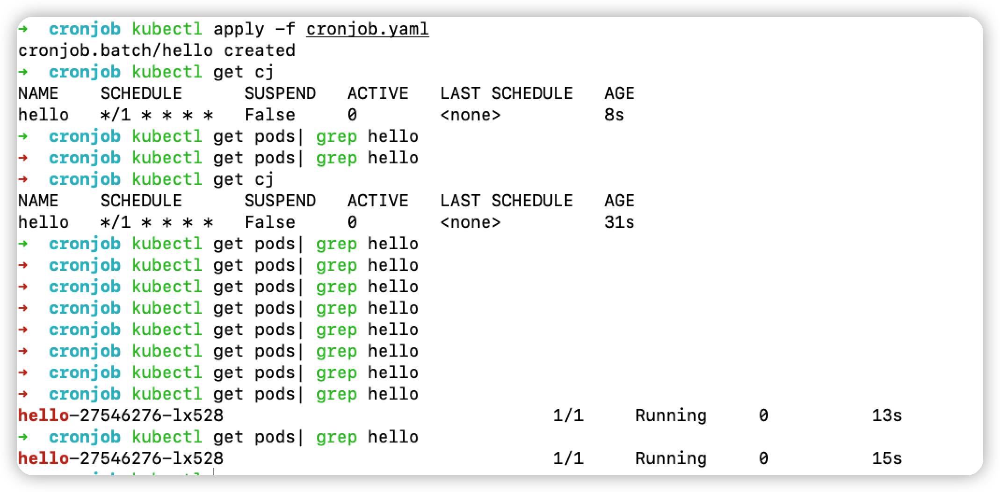
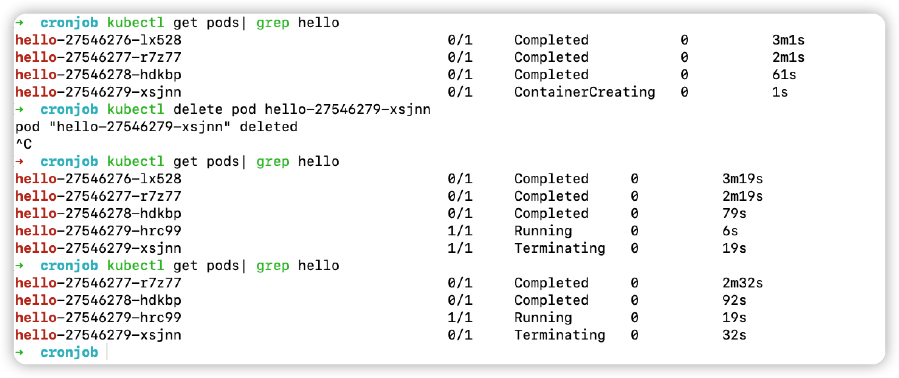
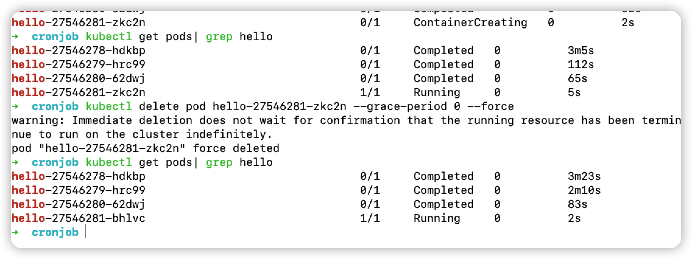
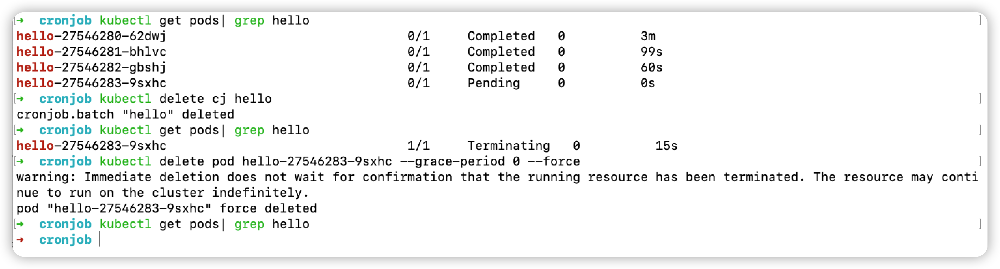

涉及的知识点：
- CronJob
- kubectl delete, kubectl logs

CronJob 有点类似Linux的crontab。

```yaml
# cronjob.yaml
apiVersion: batch/v1
kind: CronJob
metadata:
  name: hello
spec:
            # ┌───────────── 分钟 (0 - 59)
            # │ ┌───────────── 小时 (0 - 23)
            # │ │ ┌───────────── 月的某天 (1 - 31)
            # │ │ │ ┌───────────── 月份 (1 - 12)
            # │ │ │ │ ┌───────────── 周的某天 (0 - 6)（周日到周一；在某些系统上，7 也是星期日）
            # │ │ │ │ │                          或者是 sun，mon，tue，web，thu，fri，sat
            # │ │ │ │ │
            # │ │ │ │ │
            # * * * * *
  schedule: "*/1 * * * *"
  jobTemplate:
    spec:
      template:
        spec:
          containers:
          - name: hello
            image: busybox
            imagePullPolicy: IfNotPresent
            args:
            - /bin/sh
            - -c
            - date; sleep 30; echo Hello, 13sai from the Kubernetes cluster
          restartPolicy: OnFailure
```

> kubectl apply -f cronjob.yaml



运行没问题，加入发现job有问题，需要立即终止怎么办呢？如何删除正在运行的 job？

> kubectl delete pod xxx



可以看见立即生成了另一个，继续delete。

> kubectl delete pod xxx --grace-period 0 --force


虽然强制杀死了一个，但还是生成了一个，有一次失败了。

虽然删除对应的pod，但是k8s会认为这个pod执行失败，重新生成一个新的pod，所以我们应该删除源头 cronjob，然后杀掉执行中的pod。
PS: cj 是 cronjob的别名

> kubectl delete cj hello 
> kubectl delete pod xxx --grace-period 0 --force

