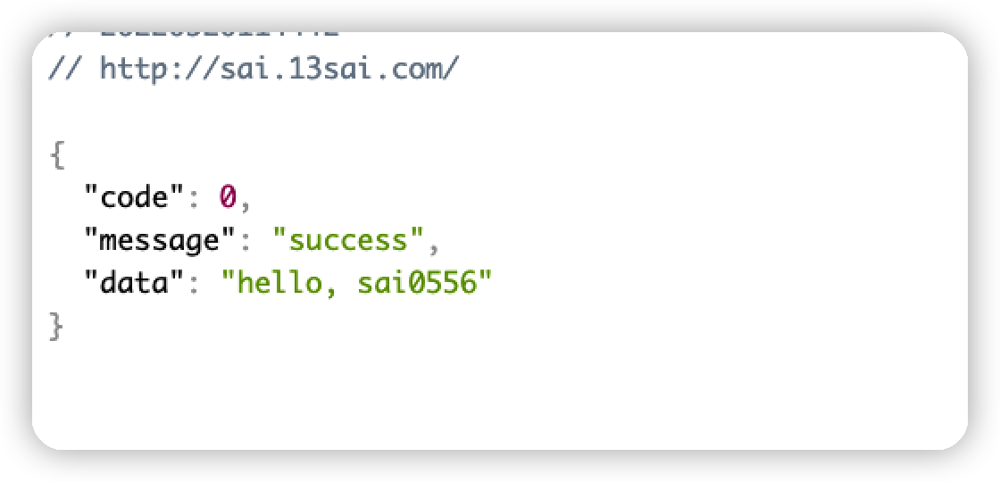

涉及的知识点：
- Ingress
- LoadBalancer

## Ingress

我们可以使用之前[部署Deployment](部署Deployment.md)的Service，具体实现：

```yaml
apiVersion: networking.k8s.io/v1
kind: Ingress
metadata:
  # Ingress 的名字，仅用于标识
  name: sai-ingress  
spec:
  # Ingress 中定义 L7 路由规则
  rules:
    # 根据 virtual hostname 进行路由（请使用您自己的域名）                  
    - host: sai.13sai.com   
      http:
        paths:
          - path: "/"
            pathType: Prefix
            backend:
              service:
                name: sai  # 指定后端的 Service 为之前创建的 sai
                port:
                  number: 80
```


## LoadBalancer

在使用支持外部负载均衡器的云提供商的服务时，设置 `type` 的值为 `"LoadBalancer"`， 将为 Service 提供负载均衡器。 负载均衡器是异步创建的，关于被提供的负载均衡器的信息将会通过 Service 的 `status.loadBalancer` 字段发布出去。

```yaml
apiVersion: v1
kind: Service
metadata:
  name: sai-lb
spec:
  selector:
    app: sai
  ports:
    - protocol: TCP
      port: 80
      targetPort: 80
  clusterIP: 10.0.171.239
  type: LoadBalancer
status:
  loadBalancer:
    ingress:
      - ip: 192.0.2.127
```

来自外部负载均衡器的流量将直接重定向到后端 Pod 上，不过实际它们是如何工作的，这要依赖于云提供商。

比如使用ucloud：
```yaml
apiVersion: v1
kind: Service
metadata:
  name: ucloud-nginx-out-tcp-new
  labels:
    app: ucloud-nginx-out-tcp-new
  annotations:
    # 代表ULB网络类型，outer为外网，inner为内网；outer为默认值，此处可省略。
    "service.beta.kubernetes.io/ucloud-load-balancer-type": "outer"
    # 表示ULB协议类型，tcp与udp等价，表示ULB4；http与httpS等价，表示ULB7；tcp为默认值，此处可省略。
    "service.beta.kubernetes.io/ucloud-load-balancer-vserver-protocol": "tcp"
    # bandwidth下默认为2Mpbs,建议显式声明带宽大小，避免费用超标。
    "service.beta.kubernetes.io/ucloud-load-balancer-eip-bandwidth": "2" 
    # 付费模式，支持month，year，dynamic，默认为month
    "service.beta.kubernetes.io/ucloud-load-balancer-eip-chargetype": "month" 
    # 付费时长，默认为1，chargetype为dynimic时无效    
    "service.beta.kubernetes.io/ucloud-load-balancer-eip-quantity": "1"     
spec:
  type: LoadBalancer
  ports:
    - protocol: TCP
      port: 80
      targetPort: 80
  selector:
    app: ucloud-nginx-out-tcp-new
```