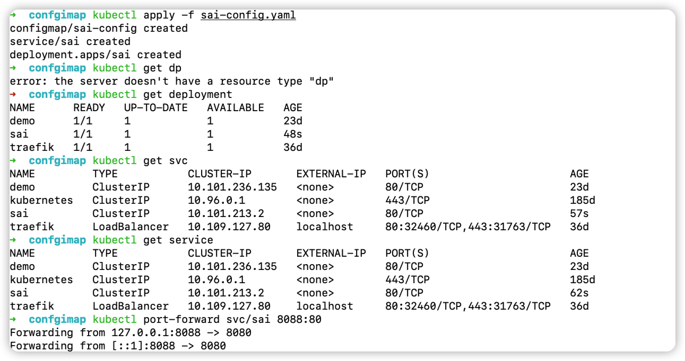
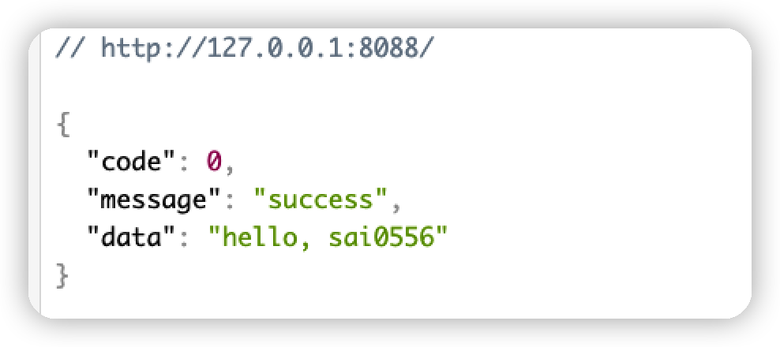
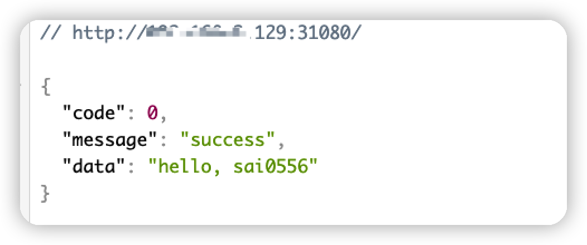

我们以部署一个可访问http服务的为例，涉及的知识点：
- ConfigMap
- Service
- Deployment
- kubectl port-forward


## 编写yaml

```yaml
# sai-config.yaml

# 定义 ConfigMap
apiVersion: v1
kind: ConfigMap
metadata: # 元数据，定义基本属性和信息
  name: sai-config # 名称
data:
  config.yaml: |-
    name: sai0556
    mode: debug
    addr: :8080
    hi: w~o~w

---
# 定义 Service
apiVersion: v1
kind: Service
metadata:
  name: sai
  labels: # 标签
    app: sai
spec: # 描述
  ports:
  - protocol: TCP
    port: 80 # Service的虚拟端口
    targetPort: 8080 # 容器暴露的端口
  selector: # 选择器，对应下面的 Deployment的 labels
    app: sai

---
# 定义 Deployment
apiVersion: apps/v1
kind: Deployment
metadata:
  name: sai
spec:
  replicas: 1 # 创建应用程序实例个数
  selector: # 标签选择器
    matchLabels: # 选择包含标签app:sai的资源
      app: sai
  template: # 模板
    metadata:
      labels:
        app: sai
    spec:
      containers:
      - name: sai
        image: 	13sai/k8s-configmap-sai:0.2
        imagePullPolicy: IfNotPresent
        command:
          - '/app/13sai'
        volumeMounts: # 数据卷挂载
          - name: config
            mountPath: /app/config.yaml
            readOnly: true
            subPath: config.yaml
      volumes: # 挂载的具体信息，这里使用的 configMap
        - name: config
          configMap:
            defaultMode: 0600
            name: sai-config
```

## 应用

```sh
kubectl apply -f sai-config.yaml
```

## 测试
使用 kubectl 查看

```sh
kubectl get deployment
kubectl get service
```



测试：
```sh
# port-forward 可以将集群映射到本地，方便debug
kubectl port-forward svc/sai 8088:80
```



可以看到请求是成功！ http://127.0.0.1:8088/

当然，也可以使用  **NodePort** 
```yaml
apiVersion: v1
kind: Service
metadata:
  name: sai
  labels: # 标签
    app: sai
spec: # 描述
  type: NodePort
  ports:
  - protocol: TCP
    port: 8080
    nodePort: 31080
  selector:
    app: sai
```

